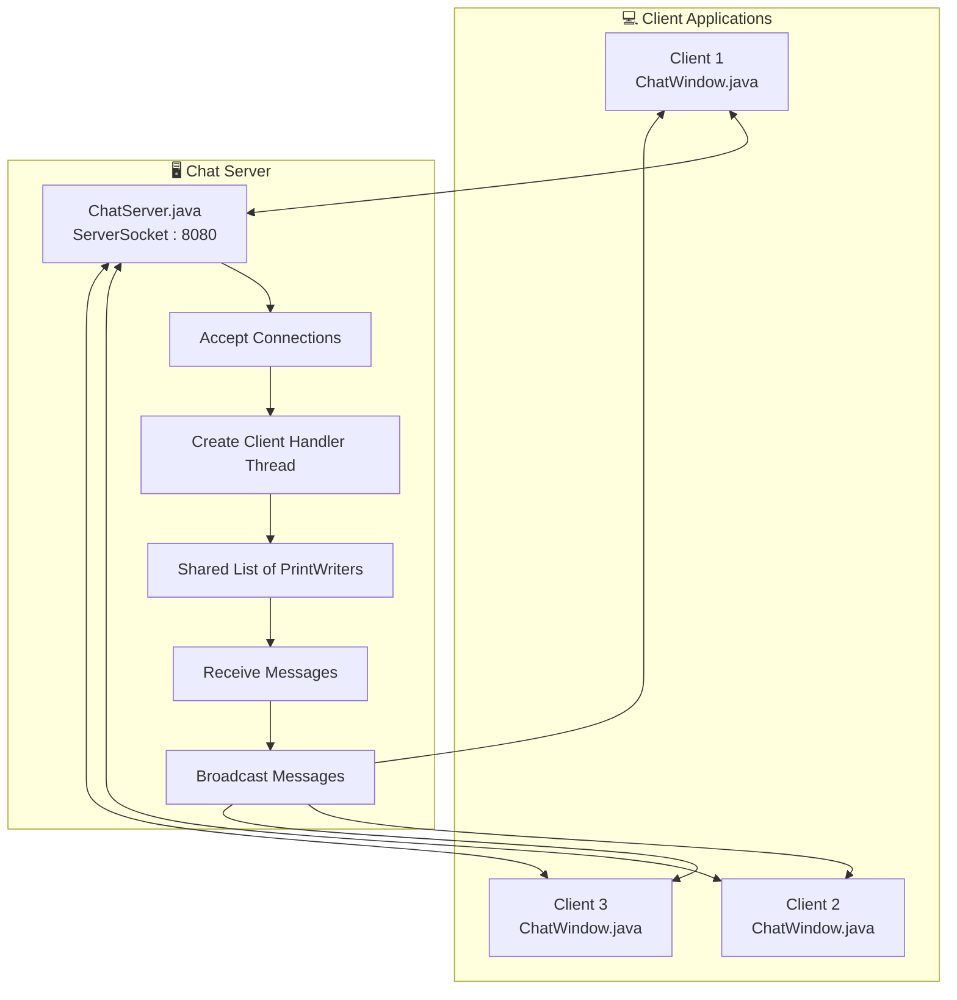
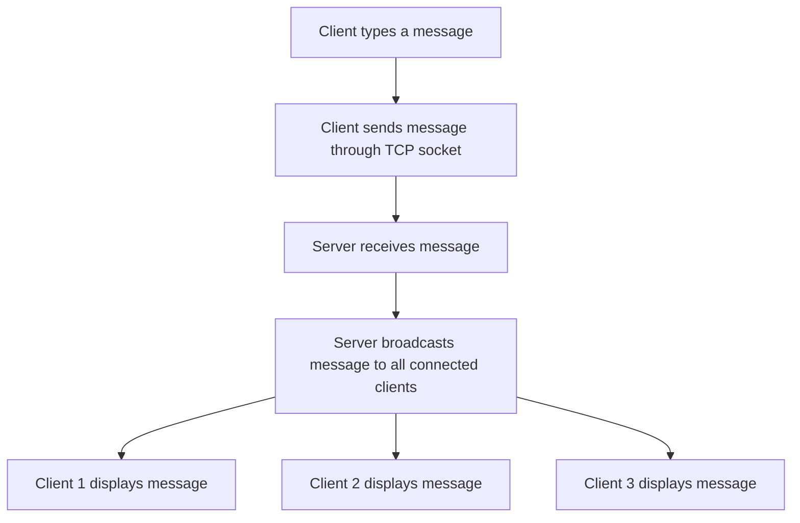
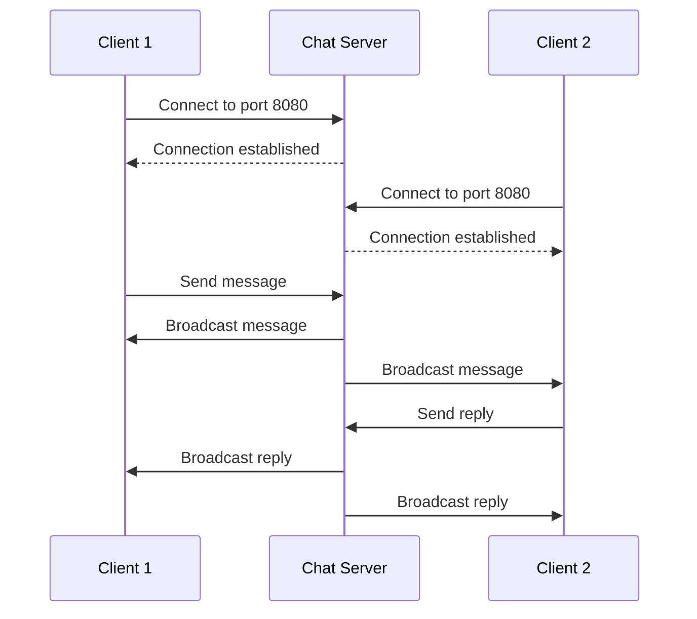

# 💬 Java LAN Chat Application

A multi-client chat application built using **Java, AWT, TCP Socket Programming, and Multithreading**. It allows multiple users to connect to a server and exchange messages in real time over a local network.

---

## 🚀 Features

* Multi-client communication
* Real-time messaging using TCP sockets
* Message broadcasting to all connected clients
* Multithreading for handling multiple clients
* Graphical user interface using Java AWT
* Client connection and disconnection handling

## 🛠️ Technologies Used

* Java
* Java AWT
* TCP Socket Programming
* Multithreading
* BufferedReader and PrintWriter

---

## 🏗️ System Architecture

The application uses a **client-server architecture**. The server accepts multiple client connections and creates a separate thread to handle each client.



---

## 🔄 Message Flow

This diagram shows how a message travels from one client to all connected clients.



---

## 🔁 Client-Server Communication Sequence



---

## ⚙️ How It Works

1. The server starts and listens on port `8080`.
2. Clients connect to the server using TCP sockets.
3. The server creates a separate thread for each connected client.
4. Each client's output stream is stored in a shared list.
5. When a client sends a message, the server broadcasts it to all connected clients.
6. Clients display the received messages in their chat windows.

---

## 📂 Project Structure

```text
java-lan-chat/
│
├── src/
│   ├── ChatServer.java
│   └── ChatWindow.java
│
├── run.bat
└── README.md
```

---

## ▶️ How to Run

### Requirements

* Java Development Kit (JDK) installed.
* Two or more client instances for multi-client testing.
* A local network connection for LAN communication between different computers.

### 1. Clone the repository

```bash
git clone https://github.com/parekhkrish/java-lan-chat.git
```

### 2. Open the project folder

```bash
cd java-lan-chat
```

### 3. Start the server

Run `ChatServer.java` first.

The server listens on port `8080`.

### 4. Start the client

Run `ChatWindow.java` to open the chat interface.

For clients on another computer, replace `localhost` in the client connection code with the server computer's local IP address.

### 5. Start chatting

Connect multiple clients and exchange messages in real time.

---

## 🔮 Future Improvements

* User join and leave notifications
* Online users list
* Message timestamps
* Improved graphical interface
* Username validation
* Better error handling and connection management
* Room-code-based connections

---

## 👨‍💻 Author

**Krish Parekh**

B.Tech Information Technology Student

[GitHub Profile](https://github.com/parekhkrish)

---

⭐ If you find this project interesting, feel free to explore the repository!
